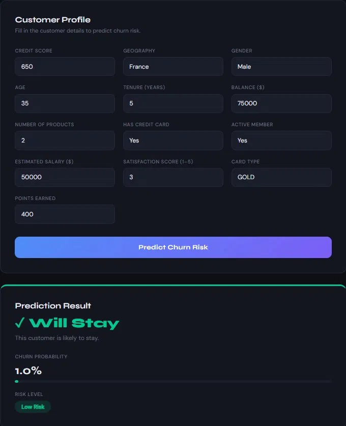
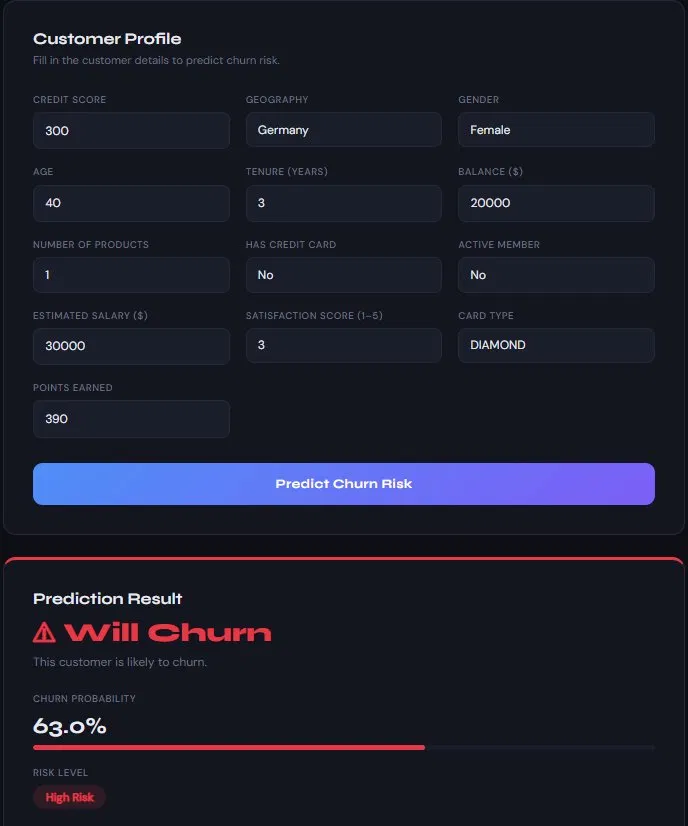
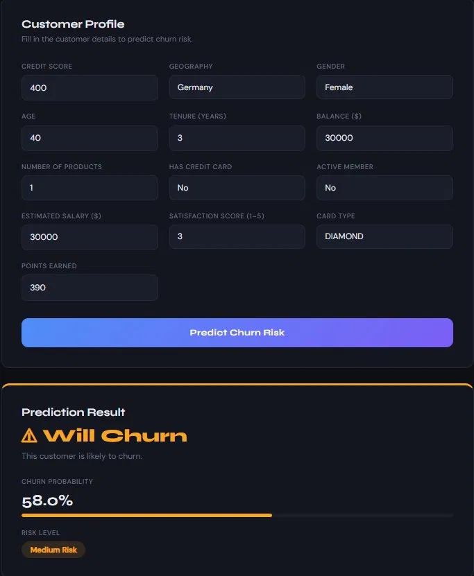

# ⬡ ChurnSense — Bank Customer Churn Prediction

ML-powered bank customer churn prediction app built with Random Forest, FastAPI, and React.

---

##  Problem Statement

Banks lose significant revenue when customers close their accounts (churn). Identifying at-risk customers early allows banks to take proactive retention actions. ChurnSense predicts whether a customer is likely to churn based on their profile data, providing a **churn probability** and **risk level** (Low / Medium / High).

---

##  Tech Stack

| Layer | Technology |
|-------|-----------|
| ML Model | Scikit-learn (Random Forest) |
| Backend API | FastAPI + Uvicorn |
| Frontend | React + Vite |
| Data | [Bank Customer Churn Dataset](https://www.kaggle.com/datasets/shubhammeshram579/bank-customer-churn-prediction) |

---

##  Model Details

- **Algorithm:** Random Forest Classifier
- **Accuracy:** 86.7%
- **Dataset:** 10,000 bank customers
- **Features used:** CreditScore, Geography, Gender, Age, Tenure, Balance, NumOfProducts, HasCrCard, IsActiveMember, EstimatedSalary, SatisfactionScore, CardType, PointEarned

###  Data Leakage Fix
The original dataset contains a `Complain` column which had **82% feature importance** — a classic case of data leakage. Customers complain *after* deciding to churn, not before. This feature was removed before training to ensure realistic predictions.

---

##  Screenshots

###  Low Risk — Will Stay

> Credit Score: 650 | France | Male | Age: 35 | Active Member → **1.0% churn probability**

---

###  High Risk — Will Churn

> Credit Score: 300 | Germany | Female | Age: 40 | Inactive → **63.0% churn probability**

---

###  Medium Risk — Will Churn

> Credit Score: 400 | Germany | Female | Age: 40 | Inactive → **58.0% churn probability**

---

##  Getting Started

### 1. Clone the repo
```bash
git clone https://github.com/Saikot313/ChurnSense.git
cd ChurnSense
```

### 2. Train the Model
```bash
pip install scikit-learn pandas numpy joblib
python train_model.py
```
This generates: `churn_model.pkl`, `scaler.pkl`, `encoder_info.json`, `feature_names.json`

### 3. Run the Backend
```bash
cd backend
pip install fastapi uvicorn
python -m uvicorn main:app --reload
```
API runs at: `http://localhost:8000`  
Interactive docs: `http://localhost:8000/docs`

### 4. Run the Frontend
```bash
cd frontend
npm install
npm run dev
```
App runs at: `http://localhost:5173`

---

## 📡 API Endpoints

| Method | Endpoint | Description |
|--------|----------|-------------|
| GET | `/` | Health check |
| GET | `/options` | Valid values for categorical fields |
| POST | `/predict` | Predict churn for a customer |

### Example Request
```json
POST /predict
{
  "CreditScore": 650,
  "Geography": "France",
  "Gender": "Male",
  "Age": 35,
  "Tenure": 5,
  "Balance": 75000,
  "NumOfProducts": 2,
  "HasCrCard": 1,
  "IsActiveMember": 1,
  "EstimatedSalary": 50000,
  "SatisfactionScore": 3,
  "CardType": "GOLD",
  "PointEarned": 400
}
```

### Example Response
```json
{
  "churn_prediction": 0,
  "churn_probability": 0.01,
  "risk_level": "Low",
  "message": "This customer is likely to stay."
}
```

---

## 👤 Author

**Md. Sakender Saikot**   
MSc in Data Science (Ongoing) — AIUB  
GitHub: [github.com/Saikot313](https://github.com/Saikot313)

